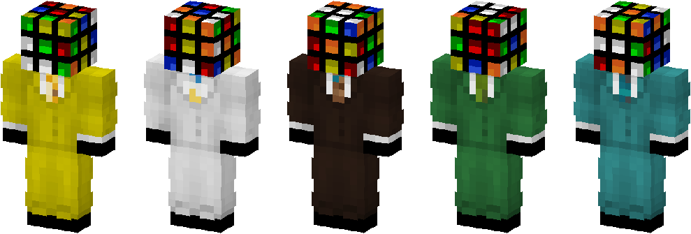
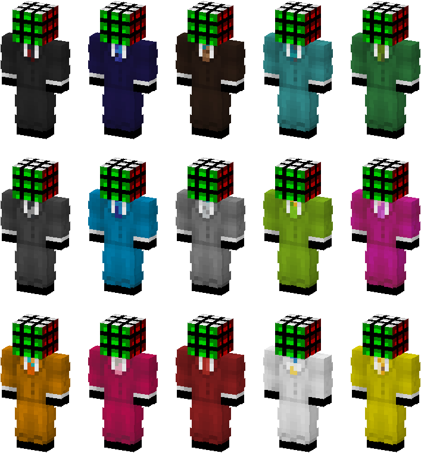

# MC-SkinRoller

MC-SkinRoller is a client-side Fabric mod that generates a new skin each time Minecraft
starts. The head is rendered as a randomly scrambled Rubik's Cube, and the body uses one
of 15 built-in suits.



> **Note:** This mod replaces the skin on your Minecraft account. Save a copy of your
> current skin before installing it.

## Features

- **Scrambled cube head.** Every skin uses a new random scramble of a valid, solvable
  cube, shown in a random orientation.
- **Built-in suits.** The body is chosen at random from 15 colour variants.
- **Custom base skin.** You can use your own skin for the body instead.

### Cube heads


### Suits



## Installation

MC-SkinRoller supports **Minecraft 1.21 to 1.21.11**.

1. Install [Fabric Loader](https://fabricmc.net/use/installer/) for your Minecraft version.
2. Download [Fabric API](https://modrinth.com/mod/fabric-api) for your Minecraft version.
3. Download the MC-SkinRoller file for your Minecraft version from the
   [Releases page](https://github.com/KristianKnudsen/MC-SkinRoller/releases).
   Each file name states the Minecraft version and the Fabric API version it was built
   with. For example, `mc-skinroller-0.1.0+mc1.21.4-fabricapi0.119.4.jar` is for
   Minecraft 1.21.4 and requires Fabric API 0.119.4 or later.
4. Place both files in your `mods` folder. On Windows, this is `%appdata%\.minecraft\mods`.
5. Launch Minecraft with the Fabric profile.

You will see the new skin after rejoining a server or restarting the game. Other players
see it the next time you join a server.

## When the skin changes

A new skin is uploaded:

- when the game starts
- when you disconnect from a server, at most once every 5 minutes

## Rate limits

Mojang limits how often a skin can be changed. Restarting the game many times in quick
succession can temporarily block skin changes and, in some cases, suspend access to
online services for up to 24 hours. If Mojang reports that the limit has been reached,
MC-SkinRoller pauses all uploads for at least one hour.

## Using your own skin

1. Place a 64x64 skin file in the `config` folder, for example `config/myskin.png`.
2. Open `config/skinroller.properties` in a text editor.
3. Set `baseSkin=myskin.png`.
4. If your skin uses slim arms, also set `variant=slim`.

Only the head is replaced. The rest of your skin is kept.

If the body appears grey, the file could not be found. Windows hides file extensions by
default, so check that the file is not named `myskin.png.png`.

## Configuration

Settings are stored in `config/skinroller.properties`:

| Setting           | Description |
|-------------------|-------------|
| `baseSkin`        | `builtin` for a random suit, or the name of a skin file (or a folder of skin files) |
| `variant`         | Arm model: `classic` or `slim` |
| `scrambleLength`  | Number of moves in each scramble (default: 25) |
| `cooldownMinutes` | Minimum minutes between uploads when disconnecting from a server (minimum: 5) |

## Troubleshooting

**The skin does not change.** Open `.minecraft/logs/latest.log` and search for
`skinroller`. The log entry describes the result, for example `skin uploaded` or
`skipped: cooldown`.

**Other problems.** [Open an issue](https://github.com/KristianKnudsen/MC-SkinRoller/issues)
and include the `skinroller` lines from your log.

## Account security

MC-SkinRoller never asks for your password. It uses the session of the running game to
upload the skin to Mojang's official API, and does not send that session anywhere else or
store it.

## Uninstalling

Remove the MC-SkinRoller file from your `mods` folder, then restore your previous skin on
[minecraft.net](https://www.minecraft.net/msaprofile/mygames/editskin).

## Credits

- **Suits** by u/w0nderbr34d, from the post
  [I made suits for every colour in the game](https://www.reddit.com/r/Minecraft/comments/wjpqde/i_made_suits_for_every_colour_in_the_game/).
- **Cube head colours and sticker style** based on the
  [USBB.1 skin on NameMC](https://namemc.com/profile/USBB.1) (creator unknown).

## Building from source

Requires JDK 21.

```
./gradlew buildAll            # jars for every supported version, in build/libs/
./gradlew build -Pmc=1.21.4   # a single version (default: the newest)
./gradlew test                # run the tests
```

`./gradlew runClient` starts a development client. It is not signed in to an account, so
skin uploads are rejected.

---

MC-SkinRoller is not affiliated with Mojang Studios or Microsoft.
